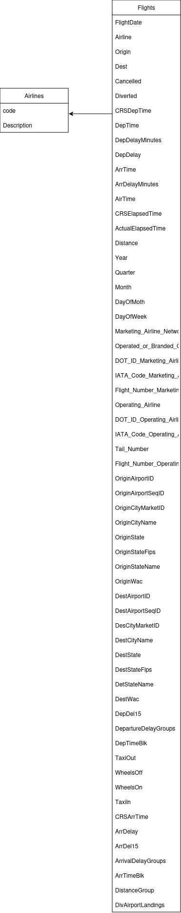
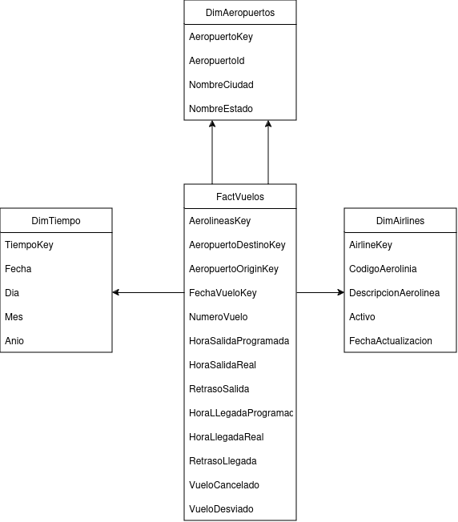

# Parcial 3
- **Enlace del video explicativo** [Parcial 3 (Youtube video)](https://youtu.be/MRddMnOoPfQ?si=wADVB9BslbiDBtIL)
- **Granularidad** Cada fila representa un vuelo de una aerolinea en especifico
- **Dimensiones**
    - DimAerolinea
    - DimAeropuerto
    - DimTiempo
- **Metricas**
    - Numero de vuelos cancelados
    - Numero de vuelos desviados
    - Minutos de retraso en una salida
    - Minutos de retraso en una llegada
    - Numero de vuelos retrasados
- **Diagrama de Data set**

  

- **Diagrama Dimensional DW**

  
